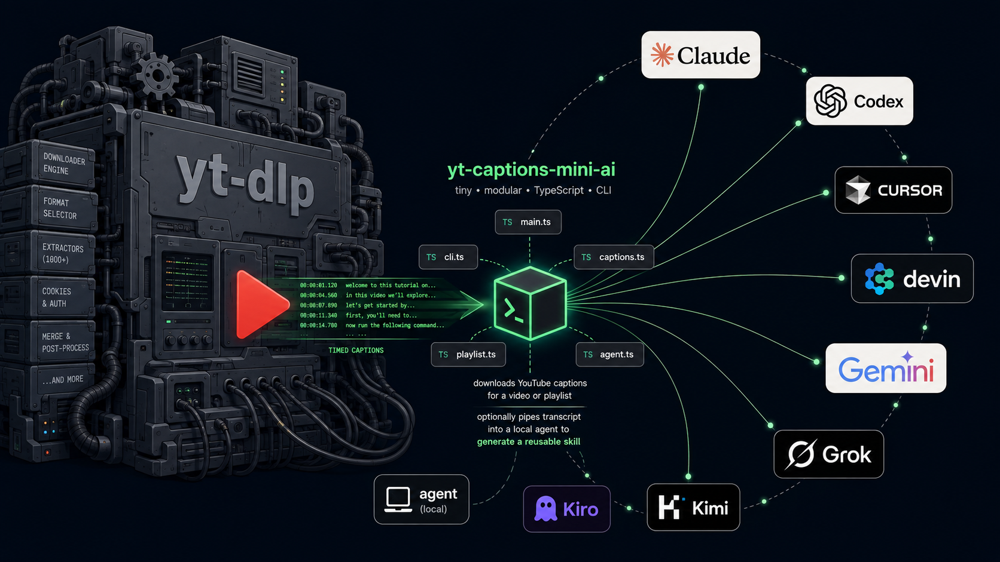

# yt-captions-mini-ai



Tiny [TypeScript](https://www.typescriptlang.org/) / [Node.js](https://nodejs.org/en) CLI that downloads public [YouTube](https://www.youtube.com/) captions — for a **video**, **playlist**, **channel**, or **channel Shorts** — and optionally pipes the transcript into a **local coding agent** to scaffold portable [`SKILL.md`](https://agentskills.io/specification) packages.

Not a second [yt-dlp](https://github.com/yt-dlp/yt-dlp). That project is the full media Swiss-army knife. This is a small, captions-only tool (focused `src/` modules) for fast public scrapes and skill scaffolding.

## Quick start

Requires [Node.js](https://nodejs.org/en) 20+.

```bash
git clone https://github.com/YosefHayim/yt-captions-mini-ai.git
cd yt-captions-mini-ai
npm install
```

### Captions only

```bash
# Single video
npm start -- url=https://www.youtube.com/watch?v=dQw4w9WgXcQ output-format=txt auto

# Playlist
npm start -- url=https://www.youtube.com/playlist?list=YOUR_PLAYLIST_ID output-format=txt auto

# Entire channel (Videos tab) → scraped-yt/channel-<name>/
npm start -- url=https://www.youtube.com/@handle output-format=txt auto

# Channel Shorts tab → scraped-yt/shorts-<name>/
npm start -- url=https://www.youtube.com/@handle/shorts output-format=txt auto
```

### Skill scaffold (captions → local agent)

The named agent CLI must already be on your `PATH` (this tool does not install agents).

```bash
npm start -- url=https://www.youtube.com/watch?v=VIDEO_ID agent=codex model=gpt-5.3-codex-spark
npm start -- url=VIDEO_ID agent=grok model=grok-4.5 reasoning-effort=high
```

Default system prompt authors **official-style skill packages** (YAML frontmatter + when-to-use + procedure), using each agent’s docs when known, otherwise [`docs/skill-authoring.md`](docs/skill-authoring.md). Extra guidance: `system-prompt="..."`.

## Output layout

| Input | Captions root |
| --- | --- |
| Single video / playlist | `./scraped-yt/` (or `out-dir=`) |
| Channel Videos tab | `./scraped-yt/channel-<name>/` |
| Channel Shorts tab | `./scraped-yt/shorts-<name>/` |

```text
scraped-yt/
  channel-<name>/
    <videoId>.en.txt
  shorts-<name>/
    <videoId>.en.txt
  agents/<agent>/<model[_effort]>/<videoId>/   # when agent= is set
    transcript.txt
    agent-raw.md
    metrics.json
    <skill-name>/SKILL.md
```

`scraped-yt/` is gitignored.

## Options

```bash
npm start -- url=<youtube-url-or-id> [options]
npm start   # interactive prompts when no args
```

| Option | Meaning | Default |
| --- | --- | --- |
| `url=` | Video, Shorts id/url, playlist, or channel (`@handle`, `/channel/UC…`, `/shorts`) | required (or interactive) |
| `format=` | Caption source formats (`vtt`, `srt`, `json3`, …) | `vtt` |
| `lang=` | Language tokens | `en` |
| `auto` | Allow auto-generated captions | off |
| `output-format=` | `txt`, `md`, `json`, `jsonl` | derived |
| `out-dir=` | Output directory | `./scraped-yt` |
| `stdout` | Print instead of writing files | off |
| `cookies=` | Optional Netscape `cookies.txt` for public session cookies | none |
| `agent=` | Local agent for skill scaffold | none |
| `model=` | Agent model id (`-m` / `--model`) | agent CLI default |
| `reasoning-effort=` | `low` \| `medium` \| `high` (when agent supports it) | none |
| `system-prompt=` | Extra skill-authoring guidance (appended to official skill contract) | empty |

Supported `agent=` values:

| `agent=` | Local CLI |
| --- | --- |
| `claude` | [Claude Code](https://code.claude.com/docs/en/overview) |
| `codex` | [OpenAI Codex CLI](https://developers.openai.com/codex) |
| `cursor` | [Cursor](https://cursor.com/docs) agent CLI |
| `devin` | Devin CLI |
| `gemini` | [Gemini CLI](https://github.com/google-gemini/gemini-cli) |
| `grok` / `agent` | Grok Build CLI |
| `kimi` | Kimi CLI |
| `kiro` | Kiro CLI (`kiro-cli`) |

Scripts: `npm run typecheck` · `npm run build` · `npm start -- url=...`

Stack: [Effect](https://effect.website/), [@clack/prompts](https://github.com/bombshell-dev/clack).

## Resilience (captions path)

Inspired by [yt-dlp](https://github.com/yt-dlp/yt-dlp) client rotation — captions-only:

- Watch-page **429** does not hard-fail; multi-client Innertube player is tried next
- Clients: `android_vr` → `android` → `ios` → `tv` → `mweb` → `web` → `web_embedded`
- HTTP retries on 429/502/503/504 with backoff and `Retry-After`
- Optional Netscape cookies + in-process `Set-Cookie` jar

## Scope

**In scope**

- Public YouTube caption tracks (manual or `auto`)
- Single video, playlist (first-page playlist state + channel browse continuations)
- Channel **Videos** and **Shorts** tabs with bulk folders
- Optional local-agent skill packaging + run metrics JSON

**Out of scope**

- Video/audio download, merge, or private/members content (use [yt-dlp](https://github.com/yt-dlp/yt-dlp))
- Cloud caption APIs or hosted services
- Installing or replacing agent products — this only **invokes** CLIs already on `PATH`
- GUI

## Docs

- [AGENTS.md](AGENTS.md) — contract for coding agents ([agents.md](https://agents.md/) convention)
- [CODE-STYLE.md](CODE-STYLE.md) — file map and style rules
- [docs/skill-authoring.md](docs/skill-authoring.md) — portable skill authoring reference

## License

MIT — see `package.json`.
